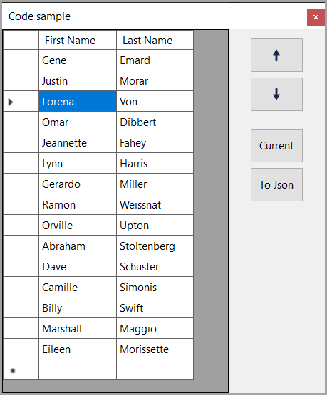

# About

A barebones example for moving rows up/down in a DataGridView which unlike DataGridViewCore project does not work with a database, instead, uses mocked data from NuGet package Bogus. There is a button which dumps the data to a json file too, in the application folder.

