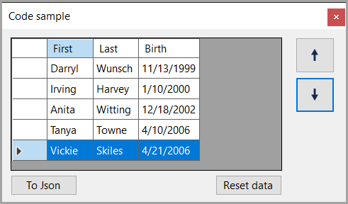
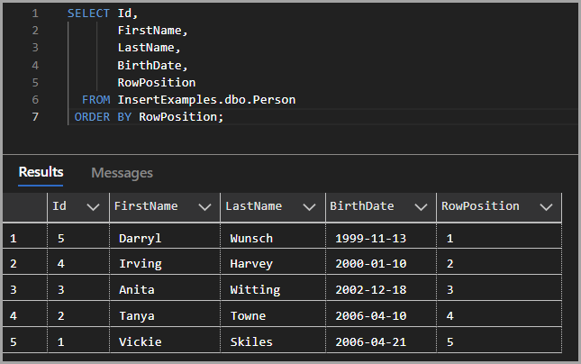

# About

This project is an example of moving rows up/down in a DataGridView using a list where the other DataGridView samples use a DataTable of the source for a DataGridView.

## Data operations

Use [Dapper](https://www.nuget.org/packages/Dapper/2.1.24?_src=template) for all operations.

## Instructions

- Create the database via script.sql in the scripts folder
- Build/Run
- To reset the data, click the Reset button which uses [Bogus](https://www.nuget.org/packages/Bogus) NuGet package to generate consistent data via a seed.

## Notes

- Dapper does not support `DateOnly` so a handler is used in the repository code.