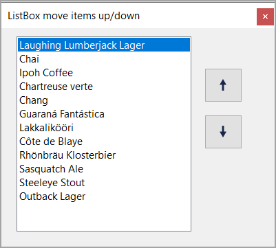

# About

Provides up/down operations for a ListBox, data is loaded from SQL-Server on app opening and saved on app closed.

- Coded using .NET Core 7 or higher
- Requires a reference to project WindowsFormControlsCore for buttons but feel free to use standard buttons.
- Database SQL-Server [script](https://github.com/karenpayneoregon/WindowsFormsMoveItemsUpDown/blob/master/DataBackEnd/DataScripts/script.sql) needs to be ran before running the project.
