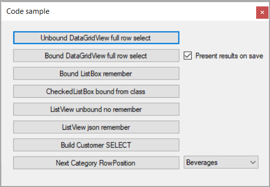

# About

This project shows how to move items up/down for `DataGridView`, `ListBox` and `ListView` using extension methods found in the class project `CommonLangageExtensionsLibrary`.

For consistency there are custom buttons located in the project WindowsFormControls.

There are also the following buttons available which are not used here but are used in the .NET Core projects.

## Data scripts

Before running any projects, create a new database named `OrderingRows1` then run the following [Script](../databackend/datascripts/script.sql)

**Starup form**

