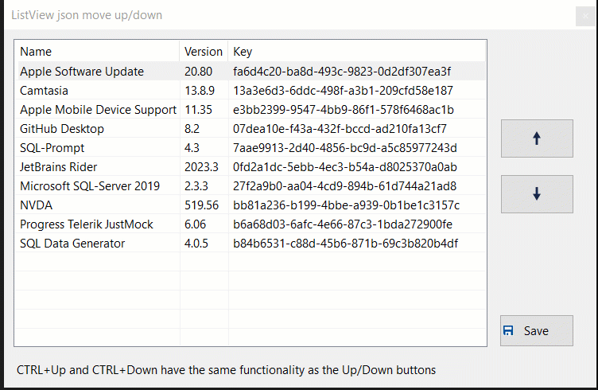

## C# Move rows up/down DataGridview and other controls
This repostory contains code to show how to move rows up and down using buttons on common Windows forms controls and remember their positions in a SQL-Server database table.
Source code for [TechNet article](https://social.technet.microsoft.com/wiki/contents/articles/51662.c-datagridview-listbox-checklistbox-listview-move-items-updown.aspx) and a more [current article](https://dev.to/karenpayneoregon/windows-form-move-items-updown-in-listview-and-more-5gp7) as TechNet is going away. 

For full documentation see [article.md](article.md)

11/2023 Added extension methods to move rows up/down with a list.

> **Note**
> The original source code was done in .NET Framework 4.8, 01/2023 added several mirror image project in .NET Core 7 using Visual Studio 2022.

### Requires

> **Note**
> There are two paths, .NET Framework 4.8 and .NET Core 8 which means, if the reader does not have VS2022 and .NET Core 8 either delete those projects or upgrade.

- Microsoft Visual Studio 2017 or higher - see note above
- Microsoft SQL-Server 2012 or higher

## Screen shots

 

 

 

 

 

