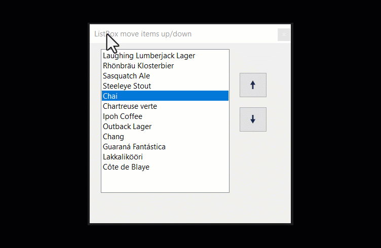

## Introduction

This article provides methods for allowing the following, DataGridView, ListBox, CheckedListBox and ListView to move rows/items up and down by means of two buttons. There are many reasons for providing this which range from displaying field names in a CheckedListBox where any items checked, moved fields up or down are moved to a ListBox to create a SQL statement which may be used in a dynamic report system. Other uses, a business requirement states that data in any of these controls allow the user of the application to order underlying items rather than A-Z or Z-A conventional ordering. This may be for display only or perhaps in an ordering system where the order is important such as in purchasing from a factious music store where the ordering becomes the order in which the user wants to hear the music. Note this functionality is natively used in several operations inside of Visual Studio and many other products.

Typical business applications which interact with data usually present data in the user interface un-sorted or sorted by a fixed order or user-defined order while there is another possibility, provide the user with an option to sort data in a non-orthodox sort order such as business wants the capability to order by row e.g. move row one in a DataGridView, a ListBox, a CheckedListBox or a ListView up or down and remember the position when reopening their application.


Example that moves items up/down with hotkeys or buttons.



## Implementation

Each control, DataGridView, ListBox, CheckedListBox, and ListView use language extensions provided in the class project CommonLangageExtensionsLibrary and CommonLangageExtensionsLibraryCore within the solution for the demonstrations. These extensions work with or without binding data to any of these controls.

## Fundamentals for working with tables

The data source for controls presenting data must be unsorted as with sorting enabled when moving rows up or down the underlying data source sort will take over and force the sort leaving the positioning appear as it didn’t work and yes it didn’t work properly.

Each database table will require an int field which will hold the row position used when displaying data in a control (DataGridView, ListBox, CheckedListBox or ListView). This field is hidden when presenting data in the user interface. Method provided do not change the row positions but instead house this field and when saving the row position will reorder them.


## Instrumenting a database table

For demonstration purposes, we will use Suppliers table from Microsoft NorthWind database which has the following columns which are for storage of business information. A field is needed to track the ordering done in code.

```sql
CREATE TABLE dbo.Suppliers(
    SupplierID INT IDENTITY(1,1) NOT NULL,
    CompanyName NVARCHAR(40) NOT NULL,
    ContactName NVARCHAR(30) NULL,
    ContactTitle NVARCHAR(30) NULL,
    Address NVARCHAR(60) NULL,
    City NVARCHAR(15) NULL,
    PostalCode NVARCHAR(10) NULL,
    Country NVARCHAR(15) NULL,
    Phone NVARCHAR(24) NULL
) ON [PRIMARY]
```

In this case a field name RowPosition is needed as shown below.

```sql
CREATE TABLE dbo.Suppliers(
    SupplierID INT NOT NULL,
    CompanyName NVARCHAR(40) NOT NULL,
    ContactName NVARCHAR(30) NULL,
    ContactTitle NVARCHAR(30) NULL,
    Address NVARCHAR(60) NULL,
    City NVARCHAR(15) NULL,
    PostalCode NVARCHAR(10) NULL,
    Country NVARCHAR(15) NULL,
    Phone NVARCHAR(24) NULL,
    RowPosition INT NULL
) ON [PRIMARY]
```

The field can be added by creating a query in Visual Studio or in SSMS (SQL-Server Management Studio)

```sql
ALTER TABLE Suppliers ADD [RowPosition] [INT] NULL
```

Then populate each row which is rather annoying if there are a good deal of rows and whenever humans are involved mistakes can be made. Instead, this can be automated. The first step is to write the statements needed in Visual Studio or SSMS. For Suppliers table the following will first check if the column RowPosition exists if it does drop the column (you could skip this step) followed by adding the column back in. Once the column exists populate each row beginning with 1.

```sql
IF EXISTS
(
    SELECT *
    FROM INFORMATION_SCHEMA.COLUMNS
    WHERE table_name = 'Suppliers'
    AND column_name = 'RowPosition'
)
BEGIN
    ALTER TABLE Suppliers DROP COLUMN RowPosition
END
 
ALTER TABLE OrderingRows.dbo.Suppliers ADD [RowPosition] [INT] NULL
 
DECLARE @MaxSurrogateKey INT = 0;
 
UPDATE  dbo.Suppliers
SET     @MaxSurrogateKey = RowPosition = @MaxSurrogateKey + 1
WHERE   RowPosition IS NULL;
SELECT * FROM Suppliers
```

Using the above this is how it's done in code (the following code is included in the source code)

```csharp
public (bool success, Exception exception) RigSuppliersTable()
{

    using (var cn = new SqlConnection() {ConnectionString = ConnectionString})
    {
        using (var cmd = new SqlCommand() {Connection = cn})
        {
            cmd.CommandText = 
                "IF EXISTS  (SELECT * FROM INFORMATION_SCHEMA.COLUMNS " + 
                "WHERE table_name = 'Suppliers'  " + 
                "AND column_name = 'RowPosition') BEGIN " +
                "ALTER TABLE Suppliers DROP COLUMN RowPosition END";

            try
            {
                cn.Open();
                cmd.ExecuteNonQuery();

                cmd.CommandText = "ALTER TABLE OrderingRows.dbo.Suppliers ADD [RowPosition] [INT] NULL";
                cmd.ExecuteNonQuery();

                cmd.Parameters.AddWithValue("@MaxSurrogateKey", 0);
                cmd.CommandText = "UPDATE  dbo.Suppliers " + 
                                  "SET @MaxSurrogateKey = RowPosition = @MaxSurrogateKey + 1 " + 
                                   "WHERE   RowPosition IS NULL; ";

                cmd.ExecuteNonQuery();

            }
            catch (Exception e)
            {
                return (false, e);
            }
        }
    }

    return (true, null);
}
```

If there are related tables they need to be done also. In the following example, we use Microsoft NorthWind database tables Category and Products tables where Products has a key back to Category (full source is included).

```csharp
public void ProductTable(int pCategoryIdentifier)
{


    var selectStatement = "SELECT ProductID,CategoryID,RowPosition " +
                          "FROM dbo.Products WHERE CategoryID = @CategoryID " +
                          "ORDER BY CategoryID, ProductName";

    var updateStatement = "UPDATE dbo.Products " +
                          "SET RowPosition = @RowPosition " +
                          "WHERE ProductID = @ProductId";

    var productList = new List<Product>();

    using (var cn = new SqlConnection() { ConnectionString = ConnectionString })
    {
        using (var cmd = new SqlCommand() { Connection = cn })
        {
            cmd.CommandText = selectStatement;
            cmd.Parameters.AddWithValue("@CategoryID", pCategoryIdentifier);

            cn.Open();

            var reader = cmd.ExecuteReader();
            var counter = 0;

            while (reader.Read())
            {
                productList.Add(new Product()
                {
                    ProductID = reader.GetInt32(0),
                    CategoryID = pCategoryIdentifier,
                    RowPosition = counter
                });

                counter += 1;
            }

            reader.Close();

            cmd.Parameters.Clear();

            cmd.CommandText = updateStatement;

            cmd.Parameters.Add(new SqlParameter()
            {
                ParameterName = "@ProductId",
                SqlDbType = SqlDbType.Int
            });

            cmd.Parameters.Add(new SqlParameter()
            {
                ParameterName = "@RowPosition",
                SqlDbType = SqlDbType.Int
            });

            for (int index = 0; index < productList.Count; index++)
            {
                cmd.Parameters["@ProductId"].Value = productList[index].ProductID;
                cmd.Parameters["@RowPosition"].Value = productList[index].RowPosition;
                cmd.ExecuteNonQuery();
            }

        }


    }
}
```

## User interface 

Implementation, examples found on the web are written directly in the form which requires moving rows up/down which means the only way to reuse them is to copy and paste which is not wise and can lead to problems down the road. The implementation in this article are in a class project where each control type has their own class.

### CheckedListBox

In the following example items are added to a CheckedListBox in the Shown event of a form. There are two buttons, one with an up arrow and one with a down arrow representing which direction to move the current item in the CheckedListBox. MoveItem is an extension method where one parameter is the direction to move the current row, the default is moving up, passing false moves the current row down.

```csharp
private void CheckedListBoxForm_Shown(object sender, EventArgs e)
{
    var ops = new Operations();
    var songList = ops.LoadAlbumSongs();
 
    foreach (Song song in songList)
    {
        checkedListBox1.Items.Add(song);
    }
}
 
private void upButton1_Click(object sender, EventArgs e)
{
    checkedListBox1.MoveItem();
}
 
private void downButton1_Click(object sender, EventArgs e)
{
    checkedListBox1.MoveItem(false);           
}
```

### ListBox

The following example loads a ListBox with a DataTable as the DataSource via a BindingSource component.

```csharp
_bsData.DataSource = _ops.LoadProductsByCategory(catIdentifier);
 
lstProducts.DisplayMember = "ProductName";
lstProducts.DataSource = _bsData;
```

In the following code assertion checks to see if there is a selected item in the ListBox, if there is MoveRowUp/MoveRowDown extension methods work with the underlying ListBox DataSource which is a BindingSource and the DataSource of the BindingSource is a DataTable. Although this can be done without a BindingSource component it is not recommended as this requires more code and BindingSource components provide many useful methods and properties for working with data.

```csharp
private void upButton_Click(object sender, EventArgs e)
{
    if (lstProducts.SelectedIndex >= 0)
    {
        lstProducts.MoveRowUp(_bsData, _ops.KeyPositionFieldName);
        _hasChanges = true;
    }
}
 
private void downButton_Click(object sender, EventArgs e)
{
    if (lstProducts.SelectedIndex >= 0)
    {
        lstProducts.MoveRowDown(_bsData, _ops.KeyPositionFieldName);
        _hasChanges = true;
    }
}
```

### DataGridView

Working with a DataGridView and remember the position in the underlying database table. The DataSource of the DataGridView in this case (similar to the ListBox above) is set to a DataTable. A private form level variable is used to determine if there are changes.

```csharp
private void upButton_Click(object sender, EventArgs e)
{
    _bsData.MoveRowUp();
             
    _hasChanges = true;
}
private void downButton_Click(object sender, EventArgs e)
{
    _bsData.MoveRowDown();
             
    _hasChanges = true;
}
```

Then in form closing event the following code checks if there are changes and if so saves the row position.

```csharp
private void DataGridViewRememberForm_FormClosing(object sender, FormClosingEventArgs e)
{
    ((DataTable) _bsData.DataSource).ReorderPositionMarker();
    if (DialogResult == DialogResult.OK)
    {
        if (_hasChanges)
        {
            _ops.UpdateProductTable((DataTable)_bsData.DataSource);
        }
    }
}
```

In the backend class, we iterate each record and update row position field.

```csharp
public bool UpdateProductTable(DataTable pDataTable)
{
    mHasException = false;
 
    var selectStatement = $"UPDATE dbo.Products SET {KeyPositionFieldName} =" +
                            $" @{KeyPositionFieldName} WHERE ProductID = @ProductId";
 
 
    using (var cn = new SqlConnection() { ConnectionString = ConnectionString })
    {
        using (var cmd = new SqlCommand() { Connection = cn })
        {
 
            cmd.CommandText = selectStatement;
            cmd.Parameters.Add(new SqlParameter()
            {
                ParameterName = $"@{KeyPositionFieldName}",
                SqlDbType = SqlDbType.Int
            });
 
            cmd.Parameters.Add(new SqlParameter()
            {
                ParameterName = "@ProductId",
                SqlDbType = SqlDbType.Int
            });
 
            try
            {
 
                cn.Open();
 
                // used to give new row postion
                int newPosition = 0;
 
                for (var rowIndex = 0; rowIndex < pDataTable.Rows.Count; rowIndex++)
                {
                    // set new row position
                    cmd.Parameters[$"@{KeyPositionFieldName}"].Value = newPosition;
 
                    cmd.Parameters["@ProductId"].Value =
                        pDataTable.Rows[rowIndex].Field<int>("ProductId");
 
                    cmd.ExecuteNonQuery();
                    newPosition += 1;
                }
 
            }
            catch (Exception e)
            {
                mHasException = true;
                mLastException = e;
            }
        }
    }
 
    return !mHasException;
}
```

### ListView

Working with moving rows up/down uses the same exact methods used as all the above and is most a like to the ListBox extension methods.

```csharp
private void upButton_Click(object sender, EventArgs e)
{
    listView1.MoveListViewItems(MoveDirection.Up);
}
private void downButton_Click(object sender, EventArgs e)
{
    listView1.MoveListViewItems(MoveDirection.Down);
}
```

## Requirements

- SQL-Server, Express edition or better.
- Visual Studio 
    - 2017 Community Edition or higher version for .NET Framework 4.8 projects
    - 2022 Community Edition or higher version for .NET Core projects
- Run the script in DataBackEnd class, script.sql either from Visual Studio or within SQL-Server Management Studio.
- Build the solution. If there are build errors that point to Newtonsoft then right click on Solution Explorer and select restore Nu Get packages and then build the solution.


## Rigging up database tables

Refer to the code in `CreateRowPosition console project` which is currently setup to rig Suppliers table with the RowPosition field along with populating the field. There is also a method which shows how to populate two related tables, Categories, and Products taken from Microsoft NorthWind database.

## Implementing in your solution

Using code in CommonLanguageExtensionsLibrary or CommonLanguageExtensionsLibraryCore provides easy methods to provide methods to move items up/down in your projects without the need to down a good deal of code directly into your forms.

## Conclusion

Using the methods above provide a developer with a clean way to implement moving items up/down in all common Windows Forms desktop projects be means of adding the CommonLanguageExtensionsLibrary project to your solution, optionally using the project WindowsFormsControls for Up and Down buttons which have predefined images.